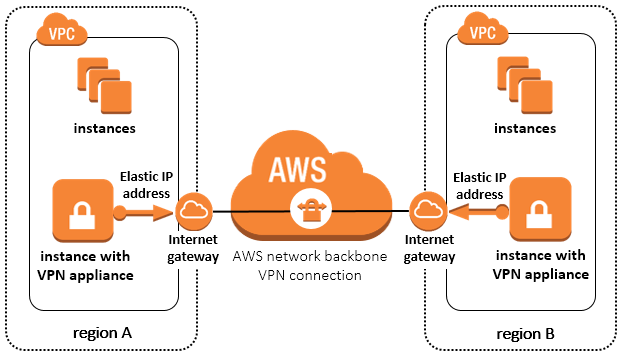

# Terraform module to provision a software site-to-site VPN connection between VPCs on AWS

## High level overview



## Prerequisites

- git
- terraform
- own or control the registered domain name for the certificate 
- have a DNS record that associates your domain name and your server’s public IP address
- Cloudflare subscription as it is used to manage DNS records automatically
- AWS subscription
- ssh key

## The module does the following:

* Create VPC-A in AWS Region A
* Create VPC-B in AWS Region B
* Create Security Group in AWS Region A
* Create Security Group in AWS Region B
* Create new static routes for VPC-B in VPC-A 
* Create new static routes for VPC-A in VPC-B
* Launch EC2 instance in VPC-A (acts as OpenVPN Access Server)
* Launch EC2 instance in VPC-B (acts as a OpenVPN Linux Gateway)
* Configure OpenVPN Access Server on EC2 in VPC-A
* Export VPN configuration from VPC-A and import the settings in OpenVPN Linux Gateway on EC2 in VPC-B
* Start the tunnel from VPC-B to VPC-A

## How to use

- Get the repo

```
https://github.com/achuchulev/terraform-aws-site-to-site-software-vpn.git
cd terraform-aws-site-to-site-software-vpn
```

- Create `terraform.tfvars` file

```
## Global

aws_access_key = "your_aws_access_key"
aws_secret_key = "your_aws_secret_key"

openvpn_remote_client_user = "client01"
openvpn_remote_client_passwd = "changemenow"

## VPN SERVER VARS

# Cloudflare vars
cloudflare_email = "atanas.v4@gmail.com"
cloudflare_token = "a25631ebcf15d3935f4d791f8d6f54af856d9"
cloudflare_zone = "ntry.site"
cloudflare_subdomain = "vpn-test25" 

subsidiary_networks = ["10.10.0.0/16"]

## Optional
# admin_user = "openvpn"
# admin_password = "openvpn"
# aws_region = "us-east-1"
# instance_type = "t2.micro"
# ami = "ami-005a7a7754837820c" # NOTE: AMIs are region specific, and listed at https://aws.amazon.com/marketplace/fulfillment?productId=fe8020db-5343-4c43-9e65-5ed4a825c931&ref_=dtl_psb_continue - click the 'launch manual' button
# vpc_cidr_block = "10.0.0.0/16"
# subnet_cidr_block = "10.0.0.0/16"
# ssh_port = 22
# ssh_cidr = "0.0.0.0/0"
# https_port = 443
# https_cidr = "0.0.0.0/0"
# tcp_port = 943
# tcp_cidr = "0.0.0.0/0"
# udp_port = 1194
# udp_cidr = "0.0.0.0/0"
# subdomain_ttl = 60


## VPN GW VARS
vpn_access_server_cidr = "10.0.0.0/16"
new_subsidiary_network = "10.10.0.0/16"

## Optional
# vpn_gw_aws_region = "us-east-2"
# vpn_gw_ami = "ami-0352bc96e72c69d2d"
# vpn_gw_instance_type = "t2.medium"
# vpn_gw_vpc_cidr_block = "10.10.0.0/16"
# vpn_gw_subnet_cidr_block = "10.10.0.0/16"
# vpn_gw_ssh_user = "ubuntu"
# vpn_gw_ssh_port = "22"
# vpn_gw_ssh_cidr = "0.0.0.0/0"
```

- Initialize terraform and deploy

```
terraform init
terraform plan
terraform apply
```
